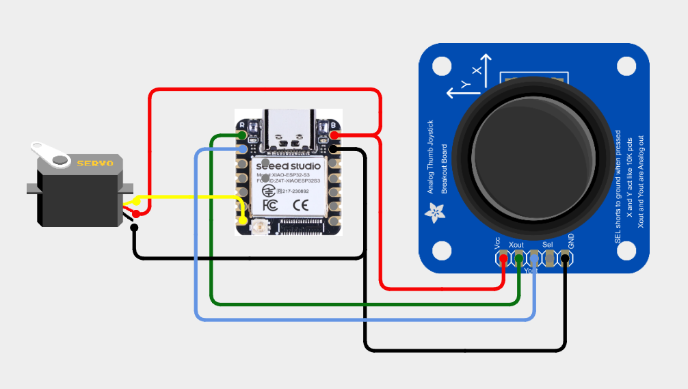

# XIAO-009-Joystick-Controlled-Servo-with-XIAO-ESP32-S3🎮 
Take control like a pro! This project uses a joystick to smoothly move a servo motor in real time with the XIAO ESP32 S3. Push the joystick left or right to rotate the servo, and experience precise, game-style motion control in hardware form! ⚙️✨

---

## 🛠️ Components Used

1. [XIAO ESP32 S3](https://robocraze.com/products/seeed-studio-xiao-esp32-s3-development-board-supports-wi-fi-bluetooth-5-0?_pos=1&_psq=XIAO+ESP32+S3&_ss=e&_v=1.0)
2. [Joystick Module](https://robocraze.com/products/joystick-module?_pos=1&_psq=JOYSTICK&_ss=e&_v=1.0)
3. [SG90 Micro Servo Motor](https://robocraze.com/products/sg90-micro-servo-motor?_pos=1&_psq=Servo+motor+%28SG90%29&_ss=e&_v=1.0)

---

## 🎥 Project Demo

📱 [Instagram Reel](https://www.instagram.com/reel/DRZXg3EkxGv/?igsh=MWdwZ2R3M2F2bGgxcw==)

---

## Circuit Diagram

---
